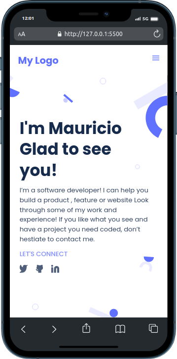

# Personal Portfolio

> I'll develop my own portfolio where I'll show my recent projects, talk a little bit about me and give an easy way to contact me.
>
> 

## Built With

- HTML, CSS & Javascript on VSCode.

## Take a look

[Live Demo 🦄](https://mauriciomonta.github.io/portfolioProject/)

## Getting Started

**Thanks for get interested on my project, I'll give you a little guide of how you can install/clone my project a test it.**

To get a local copy up and running follow these simple example steps.

### Install

    git clone https://github.com/mauriciomonta/portfolioProject.git

### Usage

    If you have Live Server extension installed on VSCode or other IDE.
    Just run it.

## Authors

👤 **Mauricio**

- GitHub: [@mauriciomonta](https://github.com/mauriciomonta)
- Twitter: [@maujsx](https://twitter.com/maujsx)
- LinkedIn: [Mauricio J. Monta](https://linkedin.com/in/linkedinhandle)

## 🤝 Contributing

Contributions, issues, and feature requests are welcome!

Feel free to check the [issues page](../../issues/).

## Show your support

Give a ⭐️ if you like this project!

## Acknowledgments

- Developer Mozilla.

## 📝 License

This project is [MIT](./LICENSE) licensed.
